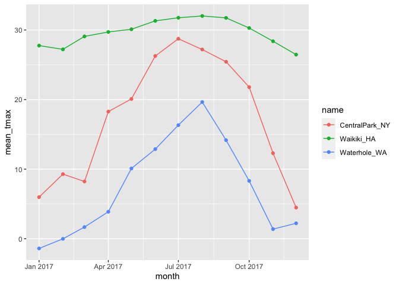

Numeric EDA
================
2022-10-06

## Load the weather data

``` r
weather_df =  
  rnoaa::meteo_pull_monitors(
    c("USW00094728", "USC00519397", "USS0023B17S"),
    var = c("PRCP", "TMIN", "TMAX"), 
    date_min = "2017-01-01",
    date_max = "2017-12-31") %>%
  mutate(
    name = recode(
      id, 
      USW00094728 = "CentralPark_NY", 
      USC00519397 = "Waikiki_HA",
      USS0023B17S = "Waterhole_WA"),
    tmin = tmin / 10,
    tmax = tmax / 10,
    month = lubridate::floor_date(date, unit = "month")) %>%
  select(name, id, everything())

weather_df
```

    ## # A tibble: 1,095 × 7
    ##    name           id          date        prcp  tmax  tmin month     
    ##    <chr>          <chr>       <date>     <dbl> <dbl> <dbl> <date>    
    ##  1 CentralPark_NY USW00094728 2017-01-01     0   8.9   4.4 2017-01-01
    ##  2 CentralPark_NY USW00094728 2017-01-02    53   5     2.8 2017-01-01
    ##  3 CentralPark_NY USW00094728 2017-01-03   147   6.1   3.9 2017-01-01
    ##  4 CentralPark_NY USW00094728 2017-01-04     0  11.1   1.1 2017-01-01
    ##  5 CentralPark_NY USW00094728 2017-01-05     0   1.1  -2.7 2017-01-01
    ##  6 CentralPark_NY USW00094728 2017-01-06    13   0.6  -3.8 2017-01-01
    ##  7 CentralPark_NY USW00094728 2017-01-07    81  -3.2  -6.6 2017-01-01
    ##  8 CentralPark_NY USW00094728 2017-01-08     0  -3.8  -8.8 2017-01-01
    ##  9 CentralPark_NY USW00094728 2017-01-09     0  -4.9  -9.9 2017-01-01
    ## 10 CentralPark_NY USW00094728 2017-01-10     0   7.8  -6   2017-01-01
    ## # … with 1,085 more rows

## Using `group_by`

Datasets are often comprised of groups defined by one or more
(categorical) variable; `group_by()` makes these groupings explicit so
that they can be included in subsequent operations. For example, we
might group weather_df by name and month:

``` r
weather_df %>%
  group_by(name, month) # Doesn't change dataset itself, but makes a new layer in the df
```

    ## # A tibble: 1,095 × 7
    ## # Groups:   name, month [36]
    ##    name           id          date        prcp  tmax  tmin month     
    ##    <chr>          <chr>       <date>     <dbl> <dbl> <dbl> <date>    
    ##  1 CentralPark_NY USW00094728 2017-01-01     0   8.9   4.4 2017-01-01
    ##  2 CentralPark_NY USW00094728 2017-01-02    53   5     2.8 2017-01-01
    ##  3 CentralPark_NY USW00094728 2017-01-03   147   6.1   3.9 2017-01-01
    ##  4 CentralPark_NY USW00094728 2017-01-04     0  11.1   1.1 2017-01-01
    ##  5 CentralPark_NY USW00094728 2017-01-05     0   1.1  -2.7 2017-01-01
    ##  6 CentralPark_NY USW00094728 2017-01-06    13   0.6  -3.8 2017-01-01
    ##  7 CentralPark_NY USW00094728 2017-01-07    81  -3.2  -6.6 2017-01-01
    ##  8 CentralPark_NY USW00094728 2017-01-08     0  -3.8  -8.8 2017-01-01
    ##  9 CentralPark_NY USW00094728 2017-01-09     0  -4.9  -9.9 2017-01-01
    ## 10 CentralPark_NY USW00094728 2017-01-10     0   7.8  -6   2017-01-01
    ## # … with 1,085 more rows

Several important functions respect grouping structures. You will
frequently use `summarize` to create one-number summaries within each
group, or use `mutate` to define variables within groups.

Because these (and other) functions will use grouping information if it
exists, it is sometimes necessary to remove groups using `ungroup()`.

## `summarize()`

Summarizing gives you group-specific summaries. The `n()` function from
`tidyverse` lets you count things in a group.

The result is a dataframe that includes the grouping variable(s) and the
desired summary.

``` r
weather_df %>% 
  group_by(name) %>% 
  summarise(
    n_obs = n()
  )
```

    ## # A tibble: 3 × 2
    ##   name           n_obs
    ##   <chr>          <int>
    ## 1 CentralPark_NY   365
    ## 2 Waikiki_HA       365
    ## 3 Waterhole_WA     365

``` r
weather_df %>% 
  group_by(name, month) %>% 
  summarise(
    n_obs = n()
  )
```

    ## # A tibble: 36 × 3
    ## # Groups:   name [3]
    ##    name           month      n_obs
    ##    <chr>          <date>     <int>
    ##  1 CentralPark_NY 2017-01-01    31
    ##  2 CentralPark_NY 2017-02-01    28
    ##  3 CentralPark_NY 2017-03-01    31
    ##  4 CentralPark_NY 2017-04-01    30
    ##  5 CentralPark_NY 2017-05-01    31
    ##  6 CentralPark_NY 2017-06-01    30
    ##  7 CentralPark_NY 2017-07-01    31
    ##  8 CentralPark_NY 2017-08-01    31
    ##  9 CentralPark_NY 2017-09-01    30
    ## 10 CentralPark_NY 2017-10-01    31
    ## # … with 26 more rows

Can we count in other ways?

To count things, you could use `count()` in place of `group_by()` and
`summarize()` if you remember that this function exists.

``` r
weather_df %>% 
  count(name, month)
```

    ## # A tibble: 36 × 3
    ##    name           month          n
    ##    <chr>          <date>     <int>
    ##  1 CentralPark_NY 2017-01-01    31
    ##  2 CentralPark_NY 2017-02-01    28
    ##  3 CentralPark_NY 2017-03-01    31
    ##  4 CentralPark_NY 2017-04-01    30
    ##  5 CentralPark_NY 2017-05-01    31
    ##  6 CentralPark_NY 2017-06-01    30
    ##  7 CentralPark_NY 2017-07-01    31
    ##  8 CentralPark_NY 2017-08-01    31
    ##  9 CentralPark_NY 2017-09-01    30
    ## 10 CentralPark_NY 2017-10-01    31
    ## # … with 26 more rows

Don’t use `table()`!!

`count()` is a useful tidyverse alternative to Base R’s `table`
function. Both functions produce summaries of how often values appear,
but `table`’s output is of class table and is hard to do any additional
work with, while `count` produces a dataframe you can use or manipulate
directly.

``` r
weather_df %>%
  pull(month) %>% 
  table
```

You can have multiple summaries. `n_distinct()` counts up the number of
distinct observations in a dataset, or for a specific column. As an
example, we count the number of observations in each month and the
number of distinct values of date in each month.

``` r
weather_df %>% 
  group_by(month) %>% 
  summarise(
    n_obs = n(), 
    n_dist = n_distinct(date)
  )
```

    ## # A tibble: 12 × 3
    ##    month      n_obs n_dist
    ##    <date>     <int>  <int>
    ##  1 2017-01-01    93     31
    ##  2 2017-02-01    84     28
    ##  3 2017-03-01    93     31
    ##  4 2017-04-01    90     30
    ##  5 2017-05-01    93     31
    ##  6 2017-06-01    90     30
    ##  7 2017-07-01    93     31
    ##  8 2017-08-01    93     31
    ##  9 2017-09-01    90     30
    ## 10 2017-10-01    93     31
    ## 11 2017-11-01    90     30
    ## 12 2017-12-01    93     31

## A brief aside on 2x2 Tables

Nothing in our dataset is conducive to a 2x2 structure, but we can try…
In a contrived example, let’s say you want to look at the number of cold
and not-cold days in Central Park and Waterhole.

``` r
weather_df %>% 
  mutate(
    cold = case_when(
      tmax <  5 ~ "cold",
      tmax >= 5 ~ "not_cold",
      TRUE      ~ ""
  )) %>% 
  filter(name != "Waikiki_HA") %>% 
  group_by(name, cold) %>% 
  summarize(n_obs = n()) %>% 
  pivot_wider(names_from = cold, 
              values_from = n_obs)
```

    ## # A tibble: 2 × 3
    ## # Groups:   name [2]
    ##   name            cold not_cold
    ##   <chr>          <int>    <int>
    ## 1 CentralPark_NY    44      321
    ## 2 Waterhole_WA     172      193

This is a “tidy” table, and it’s also a data frame. You could
re-organize into a more standard (non-tidy) 2x2 table using pivot_wider,
or you could use `janitor::tabyl:`

``` r
weather_df %>% 
  mutate(cold = case_when(
    tmax <  5 ~ "cold",
    tmax >= 5 ~ "not_cold",
    TRUE     ~ ""
  )) %>% 
  filter(name != "Waikiki_HA") %>% 
  janitor::tabyl(name, cold)
```

    ##            name cold not_cold
    ##  CentralPark_NY   44      321
    ##    Waterhole_WA  172      193

`janitor` has a lot of little functions like this that turn out to be
useful, so when you have some time you might read through all the things
you can do.

## General summaries

Standard statistical summaries are regularly computed in `summarize()`
using functions like `mean()`, `median()`, `var()`, `sd()`, `mad()`,
`IQR()`, `min()`, and `max()`. To use these, you indicate the variable
to which they apply and include any additional arguments as necessary.

You may want to compute the mean tmax for each month and location.

``` r
weather_df %>% 
  group_by(name, month) %>% 
  summarise(
    n_obs = n(), 
    mean_tmax = mean(tmax, na.rm = TRUE), # Removes missing NA values before computing mean
    sd_prcp = sd(prcp), 
    median_tmax = median(tmax, na.rm = TRUE)
  )
```

    ## # A tibble: 36 × 6
    ## # Groups:   name [3]
    ##    name           month      n_obs mean_tmax sd_prcp median_tmax
    ##    <chr>          <date>     <int>     <dbl>   <dbl>       <dbl>
    ##  1 CentralPark_NY 2017-01-01    31      5.98    79.0         6.1
    ##  2 CentralPark_NY 2017-02-01    28      9.28    63.9         8.3
    ##  3 CentralPark_NY 2017-03-01    31      8.22   114.          8.3
    ##  4 CentralPark_NY 2017-04-01    30     18.3     74.7        18.3
    ##  5 CentralPark_NY 2017-05-01    31     20.1    155.         19.4
    ##  6 CentralPark_NY 2017-06-01    30     26.3    103.         27.2
    ##  7 CentralPark_NY 2017-07-01    31     28.7     91.0        29.4
    ##  8 CentralPark_NY 2017-08-01    31     27.2     56.9        27.2
    ##  9 CentralPark_NY 2017-09-01    30     25.4     45.4        26.1
    ## 10 CentralPark_NY 2017-10-01    31     21.8    138.         22.2
    ## # … with 26 more rows

Compute same summaries across multiple variables. `Across()` lets you
compute mean from variables from `prcp` column to the `tmin` column.

``` r
weather_df %>% 
  group_by(name, month) %>% 
  summarise(across(prcp:tmin, mean))
```

    ## # A tibble: 36 × 5
    ## # Groups:   name [3]
    ##    name           month       prcp  tmax   tmin
    ##    <chr>          <date>     <dbl> <dbl>  <dbl>
    ##  1 CentralPark_NY 2017-01-01  39.5  5.98  0.748
    ##  2 CentralPark_NY 2017-02-01  22.5  9.28  1.45 
    ##  3 CentralPark_NY 2017-03-01  43.0  8.22 -0.177
    ##  4 CentralPark_NY 2017-04-01  32.5 18.3   9.66 
    ##  5 CentralPark_NY 2017-05-01  52.3 20.1  12.2  
    ##  6 CentralPark_NY 2017-06-01  40.4 26.3  18.2  
    ##  7 CentralPark_NY 2017-07-01  34.3 28.7  21.0  
    ##  8 CentralPark_NY 2017-08-01  27.4 27.2  19.5  
    ##  9 CentralPark_NY 2017-09-01  17.0 25.4  17.4  
    ## 10 CentralPark_NY 2017-10-01  34.3 21.8  13.9  
    ## # … with 26 more rows

This is a dataframe!! You can incorporate grouping and summarizing
within broader analysis pipelines. For example, we can take create a
plot based on the monthly summary:

``` r
weather_df %>% 
  group_by(name, month) %>% 
  summarise(
    mean_tmax = mean(tmax, na.rm = TRUE)
  ) %>% 
  ggplot(aes(x = month, y = mean_tmax, color = name)) +
  geom_point() + 
  geom_path()
```

<!-- -->

You can make a “less tidy” dataset. Presenting reader-friendly results
for this kind of exploratory analysis often benefits from some
un-tidying. For example, the table below shows month-by-month average
max temperatures in a more human-readable format.

``` r
weather_df %>% 
  group_by(name, month) %>% 
  summarise(
    mean_tmax = mean(tmax, na.rm = TRUE)
  ) %>% 
  pivot_wider(
    names_from = name,
    values_from = mean_tmax
  )
```

    ## # A tibble: 12 × 4
    ##    month      CentralPark_NY Waikiki_HA Waterhole_WA
    ##    <date>              <dbl>      <dbl>        <dbl>
    ##  1 2017-01-01           5.98       27.8      -1.4   
    ##  2 2017-02-01           9.28       27.2      -0.0179
    ##  3 2017-03-01           8.22       29.1       1.67  
    ##  4 2017-04-01          18.3        29.7       3.87  
    ##  5 2017-05-01          20.1        30.1      10.1   
    ##  6 2017-06-01          26.3        31.3      12.9   
    ##  7 2017-07-01          28.7        31.8      16.3   
    ##  8 2017-08-01          27.2        32.0      19.6   
    ##  9 2017-09-01          25.4        31.7      14.2   
    ## 10 2017-10-01          21.8        30.3       8.31  
    ## 11 2017-11-01          12.3        28.4       1.38  
    ## 12 2017-12-01           4.47       26.5       2.21
