Visualization
================
2022-10-04

## Load the weather data

``` r
weather_df = 
  rnoaa::meteo_pull_monitors(
    c("USW00094728", "USC00519397", "USS0023B17S"),
    var = c("PRCP", "TMIN", "TMAX"), 
    date_min = "2017-01-01",
    date_max = "2017-12-31") %>%
  mutate(
    name = recode(
      id, 
      USW00094728 = "CentralPark_NY", 
      USC00519397 = "Waikiki_HA",
      USS0023B17S = "Waterhole_WA"),
    tmin = tmin / 10,
    tmax = tmax / 10) %>%
  select(name, id, everything())

weather_df
```

    ## # A tibble: 1,095 × 6
    ##    name           id          date        prcp  tmax  tmin
    ##    <chr>          <chr>       <date>     <dbl> <dbl> <dbl>
    ##  1 CentralPark_NY USW00094728 2017-01-01     0   8.9   4.4
    ##  2 CentralPark_NY USW00094728 2017-01-02    53   5     2.8
    ##  3 CentralPark_NY USW00094728 2017-01-03   147   6.1   3.9
    ##  4 CentralPark_NY USW00094728 2017-01-04     0  11.1   1.1
    ##  5 CentralPark_NY USW00094728 2017-01-05     0   1.1  -2.7
    ##  6 CentralPark_NY USW00094728 2017-01-06    13   0.6  -3.8
    ##  7 CentralPark_NY USW00094728 2017-01-07    81  -3.2  -6.6
    ##  8 CentralPark_NY USW00094728 2017-01-08     0  -3.8  -8.8
    ##  9 CentralPark_NY USW00094728 2017-01-09     0  -4.9  -9.9
    ## 10 CentralPark_NY USW00094728 2017-01-10     0   7.8  -6  
    ## # … with 1,085 more rows

As a starting point, let’s revisit the scatterplot of `tmax` against
`tmin` made in Visualization Pt 1.

``` r
weather_df %>% 
  ggplot(aes(x = tmin, y = tmax)) + 
  geom_point(aes(color = name), alpha = .5)
```

<!-- -->

## Labels

We can add labels using the `labs()` function.

``` r
weather_df %>% 
  ggplot(aes(x = tmin, y = tmax)) + 
  geom_point(aes(color = name), alpha = .5) +
  labs(
    x = "Minimum Daily Temp (C)",
    y = "Maximum Daily Temp (C)",
    title = "Scatterplot of daily temp extremes",
    caption = "Data come from the rnoaa package",
    color = "Location"
  )
```

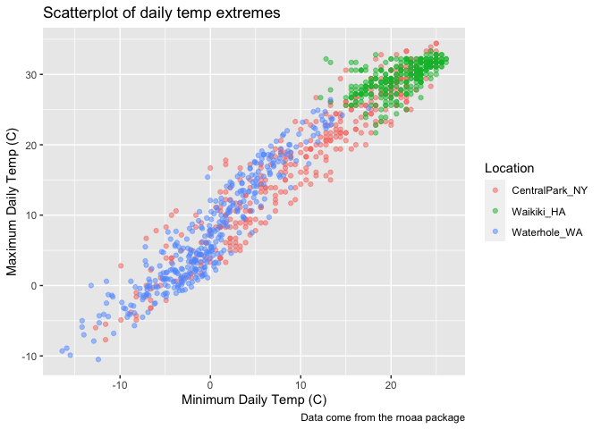<!-- -->

## Scales

You can adjust the scales and add labels to the scales. We can also
transform the scales using `trans()` (e.g. square root, etc.)

``` r
weather_df %>% 
  ggplot(aes(x = tmin, y = tmax)) + 
  geom_point(aes(color = name), alpha = .5) +
  labs(
    x = "Minimum Daily Temp (C)",
    y = "Maximum Daily Temp (C)",
    title = "Scatterplot of daily temp extremes",
    caption = "Data come from the rnoaa package",
    color = "Location"
  ) +
  scale_x_continuous(breaks = c(-10, 0, 15),
                     labels = c("-10C", "0", "15C")) +
  scale_y_continuous(
    trans = "sqrt"
  )
```

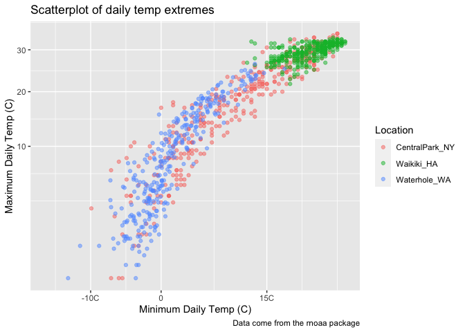<!-- -->

## Colours

We can manually adjust colours using `scale_colour_hue()`, or use the
`viridis` package. In general, encourage using the viridis colour
palette.

``` r
weather_df %>% 
  ggplot(aes(x = tmin, y = tmax)) + 
  geom_point(aes(color = name), alpha = .5) +
  labs(
    x = "Minimum Daily Temp (C)",
    y = "Maximum Daily Temp (C)",
    title = "Scatterplot of daily temp extremes",
    caption = "Data come from the rnoaa package",
    color = "Location"
  ) +
  scale_colour_hue(
    name = "Location",
    h = c(100, 300))
```

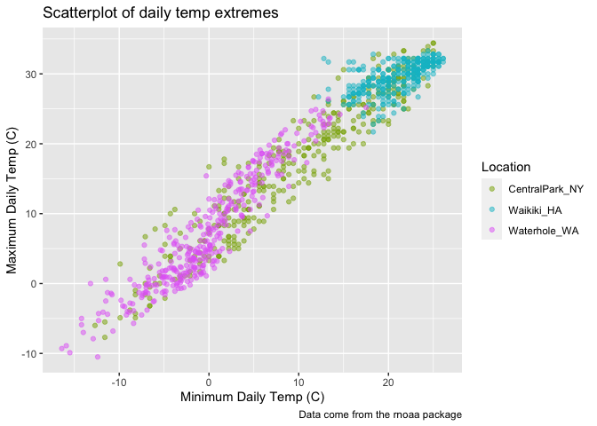<!-- -->

``` r
weather_df %>% 
  ggplot(aes(x = tmin, y = tmax)) + 
  geom_point(aes(color = name), alpha = .5) +
  labs(
    x = "Minimum Daily Temp (C)",
    y = "Maximum Daily Temp (C)",
    title = "Scatterplot of daily temp extremes",
    caption = "Data come from the rnoaa package",
    color = "Location"
  ) +
  viridis::scale_color_viridis(
    name = "Location", 
    discrete = TRUE #Makes it a discrete rather than continuous colour palette
  )
```

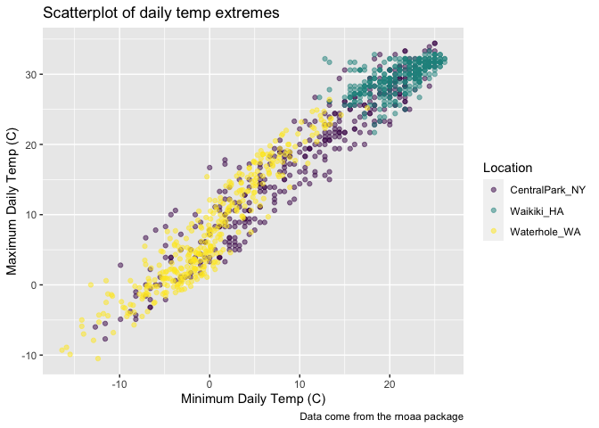<!-- -->

## Themes

``` r
ggp_weather = 
  weather_df %>% 
  ggplot(aes(x = tmin, y = tmax)) + 
  geom_point(aes(color = name), alpha = .5) + 
  labs(
    title = "Temperature plot",
    x = "Minimum daily temperature (C)",
    y = "Maxiumum daily temperature (C)",
    caption = "Data from the rnoaa package"
  ) + 
  viridis::scale_color_viridis(
    name = "Location", 
    discrete = TRUE
  )

ggp_weather
```

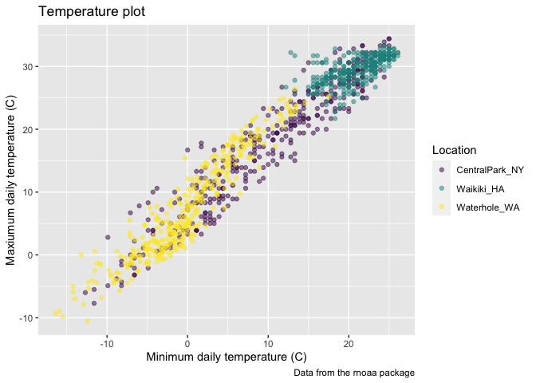<!-- -->

Move the legend to the bottom of the plot. We can get adjust the grey
background, grid bars, etc.

``` r
ggp_weather + 
  theme_minimal() +
  theme(legend.position = "bottom")
```

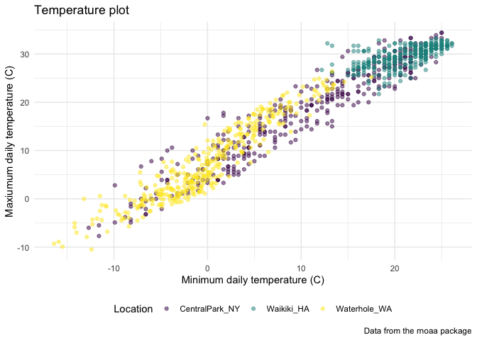<!-- -->

Make sure your theme functions in the correct order! Applying an overall
theme overrides individual adjustments to the plot element. Here, we can
see the legend is no longer at the bottom.

``` r
ggp_weather + 
  theme(legend.position = "bottom") +
  theme_minimal()
```

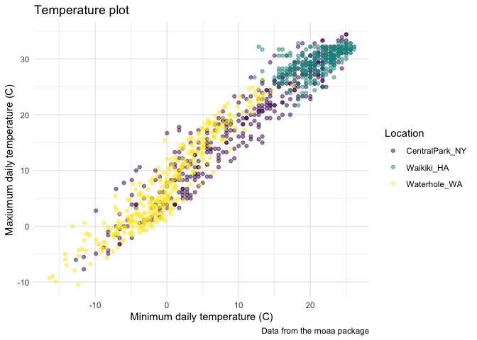<!-- -->

## Setting options

You can set global options to control all ggplots you make in a R
markdown. (see P8105 website)

## Data argument in `geom_()`

We want to use different geometries for Central Park and Waikiki data.

``` r
central_park_df = 
  weather_df %>% 
  filter(name == "CentralPark_NY")

waikiki_df = 
  weather_df %>% 
  filter(name == "Waikiki_HA")

ggplot(waikiki_df, aes(x = date, y = tmax, color = name)) +
  geom_point() + 
  geom_line(data = central_park_df)
```

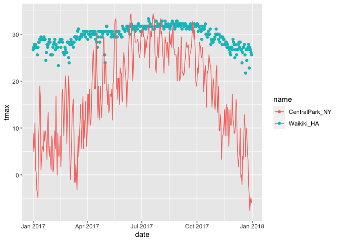<!-- -->

## Patchwork…

We want to make a panel of plots with the same dataset (same aesthetic
mappings, etc.) easily using `facet`. However, we might want to have a
panel of fundamentally different figures using `patchwork`.

``` r
tmax_tmin_plot = 
  weather_df %>% 
  ggplot(aes(x = tmin, y = tmax, colour = name)) +
  geom_point(alpha = .5) +
  theme(legend.position = "none")

prcp_density_plot = 
  weather_df %>% 
  filter(prcp > 0) %>% 
  ggplot(aes(x = prcp, fill = name)) +
  geom_density(alpha = 0.5) + 
  theme(legend.position = "none")

seasonality_plot = 
  weather_df %>% 
  ggplot(aes(x = date, y = tmax, colour = name)) + 
  geom_point(alpha = .5) + 
  geom_smooth(se = FALSE)
  theme(legend.position = "none")
```

    ## List of 1
    ##  $ legend.position: chr "none"
    ##  - attr(*, "class")= chr [1:2] "theme" "gg"
    ##  - attr(*, "complete")= logi FALSE
    ##  - attr(*, "validate")= logi TRUE

``` r
(tmax_tmin_plot + prcp_density_plot)/ seasonality_plot # This requires loading the patchwork library!
```

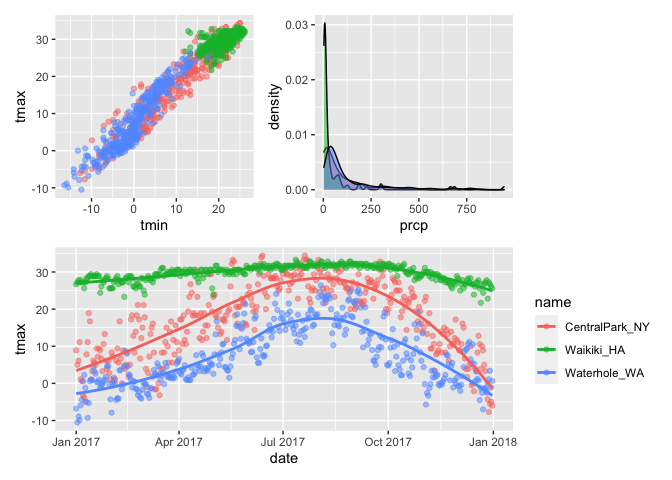<!-- -->

## Data manipulation

Working with factor variables. In the weather dataframe, the name is not
a factor variable, but when we make a plot, R treats `name` as a factor
variable. We can be more explicit about the levels of the factor
variable using `mutate()` and `fct_relevel`.

Note: `fct_*` functions come from the `forcats` package.

``` r
weather_df %>% 
  mutate(fct_relevel(name, "Waikiki_HA")) %>% 
  ggplot(aes(x = name, y = tmax)) + 
  geom_boxplot()
```

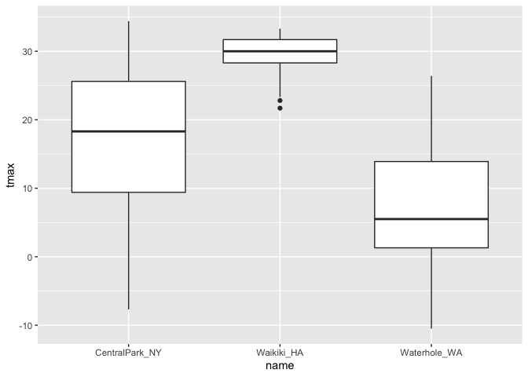<!-- -->

You can also use `fct_reorder`. We want to reorder the names based on
the median `tmax` values in ascending order.

``` r
weather_df %>% 
  mutate(name = fct_reorder(name, tmax)) %>% 
  ggplot(aes(x = name, y = tmax)) + 
  geom_boxplot()
```

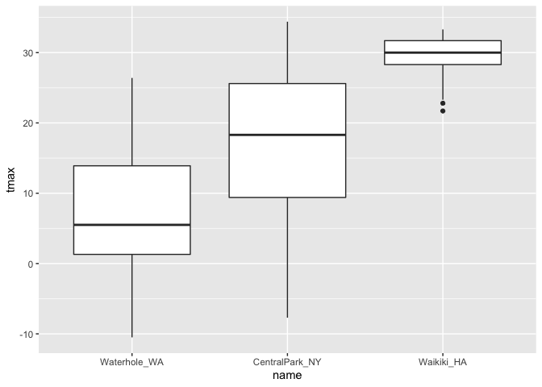<!-- -->

Sometimes, making figures involves re-structuring the data. What if we
want bdi score on the y-axis and visit number on the x-axis?

``` r
pulse_df = 
  haven::read_sas("data/public_pulse_data.sas7bdat") %>% 
  janitor::clean_names() %>% 
  pivot_longer(
    bdi_score_bl:bdi_score_12m, 
    names_to = "visit", 
    values_to = "bdi",
    names_prefix = "bdi_score_"
  ) %>% 
  select(id, visit, everything()) %>% 
  mutate(visit = fct_relevel(visit, "bl"))

pulse_df
```

    ## # A tibble: 4,348 × 5
    ##       id visit   age sex     bdi
    ##    <dbl> <fct> <dbl> <chr> <dbl>
    ##  1 10003 bl     48.0 male      7
    ##  2 10003 01m    48.0 male      1
    ##  3 10003 06m    48.0 male      2
    ##  4 10003 12m    48.0 male      0
    ##  5 10015 bl     72.5 male      6
    ##  6 10015 01m    72.5 male     NA
    ##  7 10015 06m    72.5 male     NA
    ##  8 10015 12m    72.5 male     NA
    ##  9 10022 bl     58.5 male     14
    ## 10 10022 01m    58.5 male      3
    ## # … with 4,338 more rows

``` r
pulse_df %>% 
  ggplot(aes(x = visit, y = bdi)) +
  geom_boxplot()
```

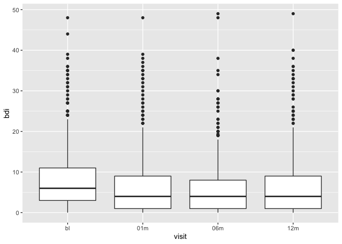<!-- -->
